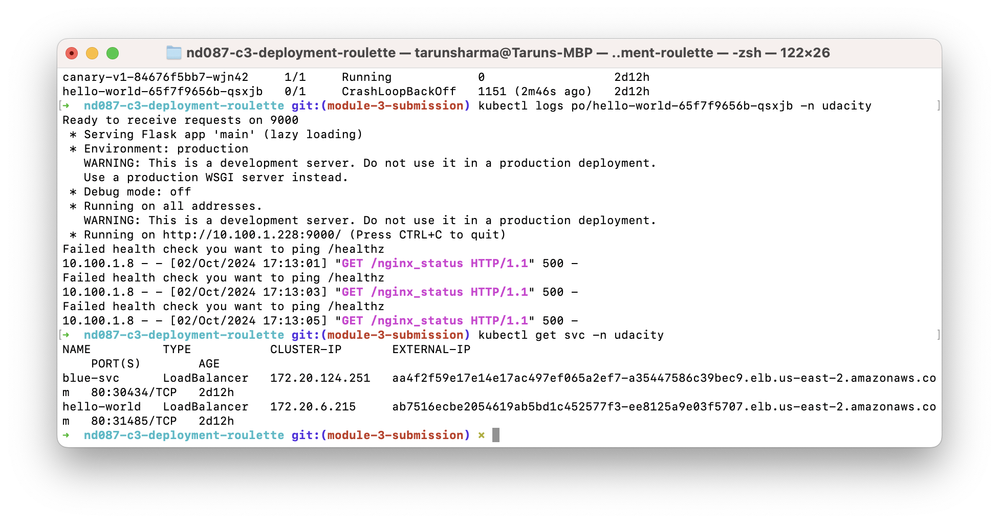
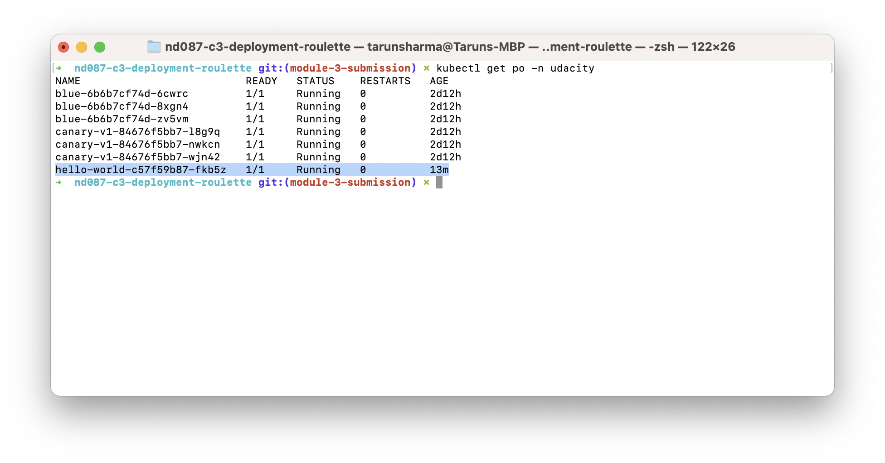
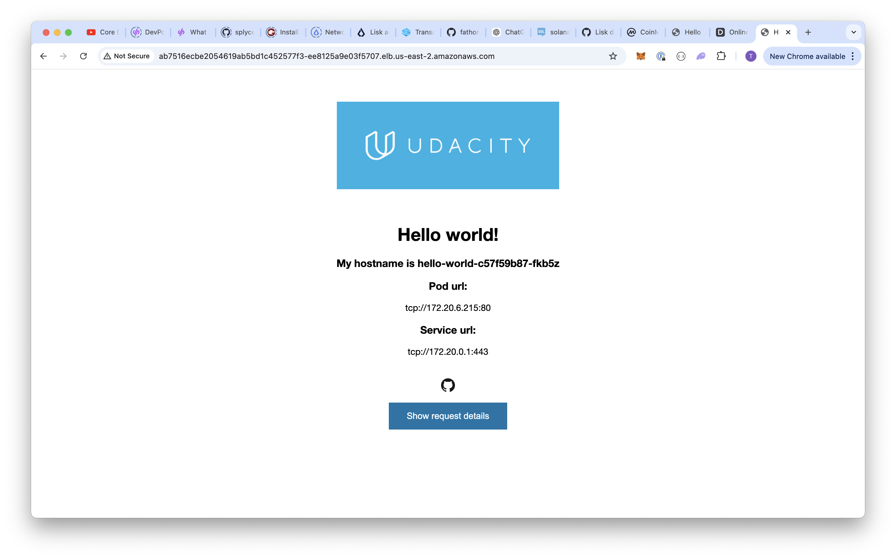

# Task-1
## Hello World Service Unreachable

## Problem
- Hello world service is not reachable

## Root Cause
As shown in terminal the expected health endpoint is `/healthz` however in [hello.yaml](../starter/apps/hello-world/hello.yml) the **livenessProbe** was set as **nginx_status** at line #28.

The fix can be found at git commit `32424c0758fdbc7f3c81847d0028cecb7e54d26e`
